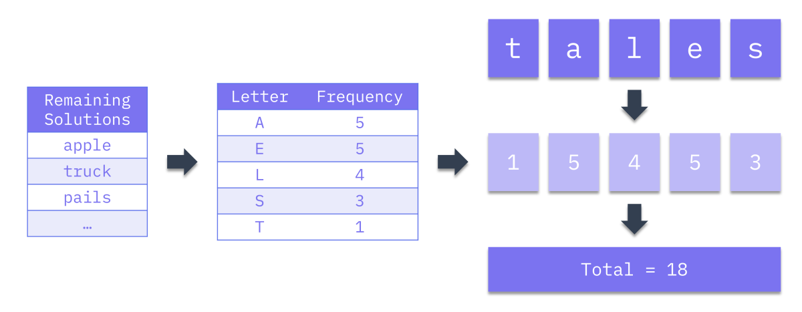
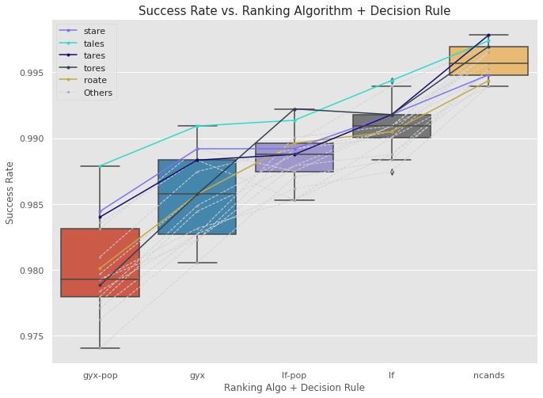

# Loaded Words: Why the "Best" Wordle Seed Words Aren't Really the Best
Over the past few weeks, I noticed more and more green, yellow, and black/white grids posted on Facebook, and that's when I discovered [Wordle](https://www.powerlanguage.co.uk/wordle/). I was hooked - not so much in playing the game the human way, but in developing a system to try to play optimally. As I read up on existing work by other authors, I found an overwhelming emphasis on starting/seed words. Yet, there were conflicting recommendations for the best ones to use. 
There was clearly more to optimal play than the seed word! The key contribution of this post is to explain why we ought to take "best" Wordle seed words with a pinch of salt, by showing that other components of a Wordle strategy affect what these are.

## The Word on Wordle
Numerous articles have been written on the subject. Most authors used simulation to find the optimal starting/seed words, while fixing other parameters (more on this later). Some of the recommended seed words were based on final game outcomes, others on algorithms to compute the expected information gain. The table below summarises each author's general approach and recommendations.


<table>
    <thead>
        <th style="text-align: center;">S/N</th>
        <th style="text-align: center;">Source</th>
        <th style="text-align: center;">Ranking Algorithm</th>
        <th style="text-align: center;">Recommended Seed Word</th>
        <th style="text-align: center;">Average No. of Steps</th>
        <th style="text-align: center;">Success Rate</th>
    </thead>
    <tbody>
        <tr>
            <td style="text-align: center;">1</td>
            <td style="text-align: center;" rowspan=3><a href="https://towardsdatascience.com/what-i-learned-from-playing-more-than-a-million-games-of-wordle-7b69a40dbfdb" target="_blank">Barry Smyth</td>
            <td rowspan=3>Minimum set covers, coverage, entropy, and letter frequencies</td>
            <td><code>tales</code></td>
            <td style="text-align: center;">3.66</td>
            <td style="text-align: center;">>95%</td>
        </tr>
        <tr>
            <td style="text-align: center;">2</td>
            <td>Two words: <code>cones-trial</code></td>
            <td style="text-align: center;">3.68</td>
            <td style="text-align: center;">96%</td>
        </tr>
        <tr>
            <td style="text-align: center;">3</td>
            <td>Three words: <code>hates-round-climb</code></td>
            <td style="text-align: center;">3.68</td>
            <td style="text-align: center;">96%</td>
        </tr>
        <tr>
            <td style="text-align: center;">4</td>
            <td style="text-align: center;" rowspan=3><a href="https://medium.com/@tglaiel/the-mathematically-optimal-first-guess-in-wordle-cbcb03c19b0a" target="_blank">Tyler Glaiel</td>
            <td rowspan=2>Expected remaining candidates</td>
            <td><code>roate</code></td>
            <td style="text-align: center;">3.494</td>
            <td style="text-align: center;">100%</td>
        </tr>
        <tr>
            <td style="text-align: center;">5</td>
            <td><code>raise</code></td>
            <td style="text-align: center;">3.495</td>
            <td style="text-align: center;">Not Provided</td>
        </tr>
        <tr>
            <td style="text-align: center;">6</td>
            <td>Expected green / yellow / grey tile scores</td>
            <td><code>soare</code></td>
            <td style="text-align: center;">3.69</td>
            <td style="text-align: center;">Not Provided</td>
        </tr>
        <tr>
            <td style="text-align: center;">7</td>
            <td style="text-align: center;"><a href="https://notfunatparties.substack.com/p/wordle-solver" target="_blank">Tom Neill</td>
            <td>Expected remaining candidates</td>
            <td><code>roate</code></td>
            <td style="text-align: center;">Not Provided</td>
            <td style="text-align: center;">Not Provided</td>
        </tr>
        <tr>
            <td style="text-align: center;">8</td>
            <td style="text-align: center;"><a href="https://towardsdatascience.com/a-deep-dive-into-wordle-the-new-pandemic-puzzle-craze-9732d97bf723" target="_blank">Sejal Dua</td>
            <td>Average green / yellow / grey tile scores</td>
            <td>
                <code>soare</code>, <code>stare</code>, <code>roate</code>, <code>raile</code>, <code>arose</code>
            </td>
            <td style="text-align: center;">N.A.</td>
            <td style="text-align: center;">N.A.</td>
        </tr>
        <tr>
            <td style="text-align: center;">9</td>
            <td style="text-align: center;"><a href="https://towardsdatascience.com/a-frequency-analysis-on-wordle-9c5778283363" target="_blank">Behrouz Bakhtiari</td>
            <td>Letter frequencies</td>
            <td><code>aries</code></td>
            <td style="text-align: center;">N.A.</td>
            <td style="text-align: center;">N.A.</td>
        </tr>
        <tr>
            <td style="text-align: center;">10</td>
            <td style="text-align: center;"><a href="https://towardsdatascience.com/optimal-wordle-d8c2f2805704" target="_blank">John Stechschulte</td>
            <td>Information entropy for expected green / yellow scores</td>
            <td>
                <code>tares</code>, <code>lares</code>, <code>rales</code>, <code>rates</code>, <code>nares</code>, <code>tales</code>, <code>tores</code>, <code>reais</code>,
                <code>dares</code>, <code>arles</code>, <code>lores</code>
            </td>
            <td style="text-align: center;">N.A.</td>
            <td style="text-align: center;">N.A.</td>
        </tr>
        <tr>
            <td style="text-align: center;">11</td>
            <td style="text-align: center;"><a href="https://markmliu.medium.com/what-in-the-wordle-5dc5ed94fe2" target="_blank">Mark M Liu</td>
            <td>Information entropy  for expected green / yellow scores</td>
            <td><code>tares</code></td>
            <td style="text-align: center;">N.A.</td>
            <td style="text-align: center;">N.A.</td>
        </tr>
    <tbody>
</table>

Wordle is a relatively recent game, and covering the entire solution space requires a great deal of effort and computing power. Therefore, there are numerous ideas left to explore and issues to address. The first issue is that optimal play is a little more complex than just seed words, as the more holistic studies (mainly [Smyth](https://towardsdatascience.com/what-i-learned-from-playing-more-than-a-million-games-of-wordle-7b69a40dbfdb)) have hinted. The second issue is that there were varying definitions of "best", and not all studies included sufficient metrics to measure the strategies' performance.

## Executive Summary - TL;DR
This post attempts to address the abovementioned issues. The aims and key insights from this post are listed here.

First, we show that what seed words are "best" depends on the other components of a Wordle strategy:

- The other components of a Wordle strategy are the **ranking algorithm** and the **decision rules for prioritising between solving and info collection**.
- The ranking algorithm heavily influences Wordle performance.
- The chosen **metric** also determines what is best, and therefore, what words are best.

Second, we introduce several metrics to measure performance and define what "best" is. These were:
- Average number of steps taken to reach a solution
- Solution success rate
- The proportion of challenges solved within 3 steps or less

## The Game
For the uninitiated, Wordle is Mastermind for 5-letter words, plus some humblebragging on social media. The aim of the game is to guess an undisclosed word in six tries. On each guess, Wordle will tell you if each letter:

- Is in the right spot (green)
- Is in the word, but the wrong spot (yellow)
- Is not in the word at all (grey)

That's all there is to it! It sounds simple, but the game isn't easy because of the sheer number of possibilities. In Wordle, there are 2,315 possible solution words, and an additional 10,657 words that are accepted as guesses ("support words"). Therefore, our bot's aim is to exploit the full set of 12,972 candidates to reduce the set of 2,315 solution words down to a single one in six tries.

> **Note:** The full sets of words can be retrieved from the website's main script. Use your browser's developer console to access it.

## Wordle Strategy
Much like Wheel of Fortune, in Wordle, we balance between **solving** (guessing a word that we think is the solution) and **collecting information** (using words to tease out what letters might be in the solution) in terms of green, yellow, and grey tiles. A human would probably play with the following strategy:

1. **Round 1: Collect as much information as possible.** We have no information at this point, so we choose some statistically optimal seed word. The better the first guess, the more information we will *probably* collect.
2. **Round 2: Collect as much information as possible *using the feedback from round 1***. While we would earn massive street cred from solving the game in two steps, this is very difficult. Hence, the best we could do in round 2 is collect more information by using a word with completely different letters from the seed word.
3. **Round 3: Depends!** If we have obtained enough information, we could go for a solve. Otherwise, it may be better to play it safe and choose another word to get more clues.
4. **Round 4: Again, it depends.** We do the same as we did in round 3. We could be more aggressive by prioritising a solve over information collection.
5. **Round 5: AGAIN, it depends.** We do the same as we did in rounds 3 and 4. By now, we should have narrowed down the options enough to solve.
6. **Round 6: 100% Solve.** It's entirely possible that we're still left with several feasible solutions by round 6. If it still isn't clear what the solution is, just hazard a guess! What do we have to lose?

We can see that a strategy is more than just the seed word. It also includes (1) decision rules to prioritise solving vs. collecting information, and (2) a way to choose words.

> **Note:** We can actually remove seed words as a strategy component altogether if we apply the ranking algorithm before the start of the game to rank the entire set of candidates. In fact, this is what the authors is sources 8-11 above did.

## A Wordle Bot

### Overview
My Wordle bot follows the broad strategy and implements the two other components of the strategy: the decision rules and a ranking algorithm for choosing words.

The bot starts off with (1) a candidate set comprising all 12,972 accepted words, and (2) a solution set comprising all 2,315 solution words. It will repeatedly measure (1) against (2), and update them both in the course of each game. The bot moves one step at a time, doing the same things in every step/round:

1. Put the remaining candidates and solutions into a ranking algorithm to calculate scores for each candidate.
2. Sort the remaining candidates by score.
3. Submit the candidate with the best score as the guess for that step.
4. Use the feedback to (a) filter candidates and (b) filter potential solutions. We also eliminate candidates that were already guessed, and candidates that contain letters that are no longer present in the remaining solution set, i.e. they have no value for filtering candidates further.
5. Repeat from step 1 until the feedback from step 4 is `GGGGG`.

I developed a `Wordle` class to facilitate games, simulated or otherwise. As this is not the focus for the post, I will be skipping over the details of its implementation. You can access the full code at my [GitHub repo](https://github.com/chrischow/wordle_solver). I mention the class only to briefly show how I ran the simulations.

```py
def play_game(input_word, solution):

    game = Wordle(wordle, wordle_answers, solution=solution, verbose=False)
    
    while not game.solved:
        if game.step == 0:
            game.guess(input_word)
        else:
            game.guess(game.optimisations[method.lower()].word.iloc[0])
        game.optimise(method='expected_gyx', n_jobs=-2)
        
    return game.records()
```

**Note:** The bot does not use brute force to enumerate all game *outcomes* before deciding on all steps. That is way too computationally intensive.

### Ranking Algorithms
The ranking algorithm is arguably the most critical component of the strategy because it determines what guesses are available. Decision rules only decide among the available guesses provided by the algorithm, and the seed word can be thought of as a *product* of the ranking algorithm, computed before the game starts.

My Wordle bot has several built-in options: (1) letter frequency, (2) expected green, yellow, and grey tiles, and (3) expected max number of remaining candidates. Each algorithm computes scores for all remaining candidates with respect to the remaining solutions.

#### Letter Frequencies
This algorithm ranks words by how popular its constituent letters are:

1. Count the frequencies of letters for all remaining solutions
2. Create a lookup table of letters to counts 
3. Score each remaining candidate by taking the sum of frequency scores for the letters in that candidate word
4. Pick the candidate with the highest score

<figure align="center">
    
    <figcaption>Letter frequency scores. Image by author. </figcaption>
</figure>

#### Expected Green/Yellow/Grey Tile Scores
This algorithm ranks words by the expected information gained, based on the number of green tiles and yellow tiles returned, averaged across all remaining solutions. I called this GYX scores for simplicity, and because of the way I coded grey (`X`) in the feedback for the `Wordle` class. For each remaining candidate:

1. Do the following against each remaining solution:
    1. Calculate the feedback against that solution
    2. Compute `GYX Score = 2 * No. of Greens + No. of Yellows`
2. Consolidate the list of GYX scores
3. Take the average of all scores to produce a single score for that candidate

Finally, pick the candidate with the highest score.

<figure align="center">
    
    <figcaption>Expected green/yellow/grey tile scores. Image by author. </figcaption>
</figure>

#### Max Number of Remaining Candidates
This algorithm ranks candidates by how many possibilities they would eliminate / leave behind if guessed, in the worst case across all remaining solutions. The idea is to choose words that cut the candidate set down the most. For each remaining candidate:

1. Do the following against each remaining solution:
    1. Calculate the feedback against that solution
    2. Use the feedback to filter (a copy of) the remaining candidate set
    3. Count the resulting number of candidates remaining
2. Consolidate the list of counts
3. Take the maximum of all counts

Finally, pick the candidate with the lowest score, because it leaves behind the least possibilities in the worst case.

<figure align="center">
    
    <figcaption>Max number of remaining candidates. Image by author. </figcaption>
</figure>

### Decision Rules
The baseline decision rule was that we would only guess solution words if there were 20 solutions or fewer remaining. This is in line with our strategy, where we prioritise solving over collecting information as we converge on the solution.

The only other optional decision rule tested was to choose words purely by popularity as measured by word frequencies in Wikipedia articles (source: [Lexipedia](https://en.lexipedia.org/)). The rule kicked in when there were only 10 solutions left, and was **slapped on top of the baseline rule**. I chose a threshold of 10 remaining solutions arbitrarily, though I'm sure there's a better way to choose this number. Under this rule, the bot would guess the most popular word among the remaining solutions.

## Simulations
I ran each of the words recommended by the various sources from the previous section (see below) against the full set of 2,315 solution words **5 times** - one per ranking algo / decision rule configuration.

Seed words:

```
1. arles    10. rates
2. arose    11. reais
3. dares    12. roate
4. lares    13. soare
5. lores    14. stare
6. nares    15. tales
7. raile    16. tares
8. raise    17. tores
9. rales
```

Ranking algo and decision rule:

| Configuration | Ranking Algorithm | Decision Rule |
| :-----------: | :---------------- | :------------ |
| 1             | Letter Frequencies (`lf`) | Baseline only |
| 2             | Letter Frequencies (`lf`) | Baseline + Popularity |
| 3             | GYX Scores (`gyx`) | Baseline only |
| 4             | GYX Scores (`gyx`) | Baseline + Popularity |
| 5             | Max Remaining Candidates (`ncands`) | Baseline only |

Overall, that's 17 "best" words by 5 strategies by 2,315 solution words for a total of **196,775 games of Wordle**.

From here on out, I will refer to the combination of ranking algorithms and decision rules as just **ranking algorithms/algos** for simplicity, since the ranking algorithms are primarily responsible for progress in the game.

### Metrics
We now jump ahead to the proposed metrics before discussing the simulation results. To allow other authors to make comparisons to the strategies tested, I identified three metrics to measure every strategy (seed word + ranking algo):

1. Average number of steps taken to reach a solution
2. Solution success rate
3. The proportion of challenges solved within 3 steps or less

Jointly, these metrics tell us (1) how good the strategy was overall in terms of steps, (2) what proportion of the 2,315 solution words it could solve, and (3) how good the bot was at solving challenges in as few steps as possible (i.e. street cred).

## Results

### Overall
Overall, the results showed that the "best" seed word depended on (1) the other strategy components - especially the ranking algo - and (2) the performance metric used. Here were the rank-1 seed words for the respective strategy settings and metrics:

| Ranking Algorithm | Mean No. of Steps | Success Rate | % Solved Within 3 Steps |
| :---------------- | :---------------: | :----------: | :---------------------: |
| Max Remaining Candidates (`ncands`) | <code style="background-color:#27ddcb; color: black;">tales</code> - 3.6017 | <code style="background-color:#120c6e; color: white;">tares</code> - 99.78% | <code style="background-color:#ff5364; color: white;">raile</code> - 48.12% | 
| Letter Frequencies (`lf`) | <code style="background-color:#7b73f0; color: white;">stare</code> - 3.7287 | <code style="background-color:#27ddcb; color: black;">tales</code> - 99.44% | <code style="background-color:#ffbac1; color: black;">arose</code> - 42.98% |
| Letter Frequencies + Popularity (`lf-pop`) | <code style="background-color:#333f50; color: white;">tores</code> - 3.7702 | <code style="background-color:#333f50; color: white;">tores</code> - 99.22% | <code style="background-color:#ffbac1; color: black;">arose</code> - 42.33% |
| GYX Scores (`gyx`) | <code style="background-color:#7b73f0; color: white;">stare</code> - 3.8320 | <code style="background-color:#27ddcb; color: black;">tales</code> - 99.09% | <code style="background-color:#F6DC75; color: black;">roate</code> - 38.57% |
| GYX Scores + Popularity (`gyx-pop`) | <code style="background-color:#27ddcb; color: black;">tales</code> - 3.8898 | <code style="background-color:#27ddcb; color: black;">tales</code> - 98.79% | <code style="background-color:#F6DC75; color: black;">roate</code> - 37.93% |

Below, I present box plots of the scores for each of the 17 "best" seed words across the various ranking algos and metrics. I also highlighted the scores and progression for several seed words that were consistently among the top few across the ranking algos.

First, we notice that the biggest impact on performance was the **ranking algo**. We see clear differences in the distributions of seed word performance for each of the three metrics. In particular, the Max Remaining Candidates ranking algo performed much better than the others, such that the worst performing seed word did better than the best from all the other strategies.

Second, we see that the "best" seed words changed ranks when different **ranking algos** were used. This was more obvious for some than others. For example, `raile` (red) was ranked 13th for mean steps to reach a solution under the GYX Scores algo, but jumped all the way up to 2nd under the Max Remaining Candidates algo. This gives us reason to believe that using different algos would probably result in different "best" seed words.

Third, the "best" seed words were not the best for all **metrics**. In fact, each metric had a different optimal *strategy*. The seed words that performed relatively well across the various ranking algos were: <code style="background-color:#7b73f0; color: white;">stare</code>, <code style="background-color:#27ddcb; color: black;">tales</code>, <code style="background-color:#120c6e; color: white;">tares</code>, <code style="background-color:#333f50; color: white;">tores</code>, and <code style="background-color:#F6DC75; color: black;">roate</code>. These are plotted in their respective colours in the charts below.

<figure align="center">
    
    <figcaption>Mean Steps vs. Ranking Algorithm + Decision Rule. Image by author.</figcaption>
</figure>

<figure align="center">
    
    <figcaption>Mean Steps vs. Ranking Algorithm + Decision Rule. Image by author.</figcaption>
</figure>

<figure align="center">
    
    <figcaption>Mean Steps vs. Ranking Algorithm + Decision Rule. Image by author.</figcaption>
</figure>

### The Best Strategies
Next, we zoom in on the top 5 strategies for each metric. All of them involved the **Max Remaining Candidates** ranking algo and **Baseline** decision rule. The results show how different seed words are better for different objectives.

The top strategies based on the **average number of steps to reach a solution** were:

| Rank | Seed Word | Ranking Algo | Decision Rule | Mean No. of Steps |
| :--: | :-------: | :----------: | :-----------: | :---------------: |
| 1    | <code style="background-color:#27ddcb; color: black;">tales</code> | Max Remaining Candidates | Baseline | 3.6017 | 
| 2    | <code style="background-color:#ff5364; color: white;">raile</code> | Max Remaining Candidates | Baseline | 3.6069 |
| 3    | <code style="background-color:#7b73f0; color: white;">stare</code> | Max Remaining Candidates | Baseline | 3.6112 |
| 4    | <code style="background-color:#F6DC75; color: black;">roate</code> | Max Remaining Candidates | Baseline | 3.6117 |
| 5    | <code style="background-color:#120c6e; color: white;">tares</code> | Max Remaining Candidates | Baseline | 3.6121 |

The top strategies by **solution success rate** were close. The difference between ranks 1 to 2 and 2 to 3 was 0.0432%, which translate to just 1 out of 2,315 games.

| Rank | Seed Word | Ranking Algo | Decision Rule | Success Rate | Lead Over Next Rank |
| :--: | :-------: | :----------: | :-----------: | :----------: | :-----------------: |
| 1    | <code style="background-color:#120c6e; color: white;">tares</code> | Max Remaining Candidates | Baseline | 99.78% | 1 game |
| 2    | <code style="background-color:#27ddcb; color: black;">tales</code> | Max Remaining Candidates | Baseline | 99.74% | 1 game |
| 3    | <code style="background-color:#333f50; color: white;">tores</code> | Max Remaining Candidates | Baseline | 99.70% | - |
| 3    | <code style="background-color:#8490b7; color: white;">arles</code> | Max Remaining Candidates | Baseline | 99.70% | - |
| 3    | <code style="background-color:#8497b0; color: white;">rales</code> | Max Remaining Candidates | Baseline | 99.70% | 1 game |

The top strategies by **proportion of challenges solved within 3 steps or less** were:

| Rank | Seed Word | Ranking Algo | Decision Rule | % Solved in 3 Steps | Lead Over Next Rank |
| :--: | :-------: | :----------: | :-----------: | :---------------------: | :-----------------: |
| 1    | <code style="background-color:#ff5364; color: white;">raile</code> | Max Remaining Candidates | Baseline |  48.12% | 11 games |
| 2    | <code style="background-color:#F6DC75; color: black;">roate</code> | Max Remaining Candidates | Baseline |  47.65% | 12 games |
| 3    | <code style="background-color:#7b73f0; color: white;">stare</code> | Max Remaining Candidates | Baseline |  47.13% | 3 games |
| 4    | <code style="background-color:#8497b0; color: white;">soare</code> | Max Remaining Candidates | Baseline |  47.00% | 6 games |
| 5    | <code style="background-color:#27ddcb; color: black;">tales</code> | Max Remaining Candidates | Baseline |  46.74% | 12 games |


## Limitation: For Bots, By Bots
The key limitation of the findings from this post and others like it is that the recommended seed words are not necessarily applicable to casual Wordlers. We've shown that the optimal seed words depend on how you play the game and what metric you're trying to optimise. Unless you can play like a bot, which has (1) perfect information on the solution space and (2) the computing power to evaluate a big chunk of it using ranking algos, the optimal seed word *for you* may be different.

That said, it is only practical for a human player to focus on seed words because that is actionable. If we absolutely need a recommendation on what seed words to use, we should look at those that generally performed well across the three metrics **and** across the various ranking algos (plotted in their respective colours in the graphs above). They *could* perform well on different styles of play, but more work is needed to verify this with a more human-like bot and understand why these words work well.

## Conclusion
In this post, we showed that changing other pieces of a strategy, namely the (1) ranking algorithm and (2) decision rules for prioritising between solving vs. information collection affect what the "best" seed word is. The metric in question, be it the (a) average number of steps to reach a solution, (b) success rate, or (c) proportion of challenges solved within 3 steps, is important for determining what "best" means, and by extension, what the "best" seed word is.

Based on these conclusions, we should not simply accept seed word recommendations that were generated based on outcomes (e.g. number of steps to reach a solution) from simulated games played with inhuman bots. A deeper dive is needed to identify words that work well regardless of who - or what - is using them.