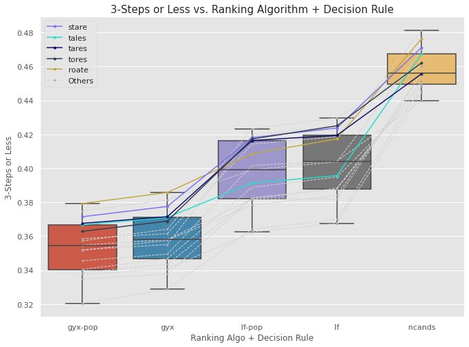

# Solving Wordle
Over the past few weeks, I noticed more and more green, yellow, and black/white grids posted on Facebook, and that's when I discovered [Wordle](https://www.powerlanguage.co.uk/wordle/). I was hooked - not so much in playing the game the human way, but in developing a system to try to play optimally. As I read up on existing work by other authors, I found an overwhelming emphasis on starting/seed words. Yet, there were conflicting recommendations for the best ones to use. 
There was clearly more to optimal play than the seed word! The key contribution of this post is to show that other components of a Wordle strategy affect what the best seed words are.

## The Word on Wordle
Numerous articles have been written on the subject. Most authors used simulation to find the optimal starting/seed words, while fixing other parameters (more on this later). The recommended seed words were based on final game outcomes. I imagine that they focused on seed words in an effort to make the findings relevant and easy to digest for their readers. The table below summarises each author's general approach and recommendations.


<table>
    <thead>
        <th style="text-align: center;">Source</th>
        <th style="text-align: center;">Ranking Algorithm</th>
        <th style="text-align: center;">Recommended Seed Word</th>
        <th style="text-align: center;">Average No. of Steps</th>
        <th style="text-align: center;">Success Rate</th>
    </thead>
    <tbody>
        <tr>
            <td style="text-align: center;" rowspan=3><a href="https://towardsdatascience.com/what-i-learned-from-playing-more-than-a-million-games-of-wordle-7b69a40dbfdb" target="_blank">Barry Smyth</td>
            <td rowspan=3>Minimum set covers, coverage, entropy, and letter frequencies</td>
            <td><code>tales</code></td>
            <td style="text-align: center;">3.66</td>
            <td style="text-align: center;">>95%</td>
        </tr>
        <tr>
            <td>Two words: <code>cones-trial</code></td>
            <td style="text-align: center;">3.68</td>
            <td style="text-align: center;">96%</td>
        </tr>
        <tr>
            <td>Three words: <code>hates-round-climb</code></td>
            <td style="text-align: center;">3.68</td>
            <td style="text-align: center;">96%</td>
        </tr>
        <tr>
            <td style="text-align: center;" rowspan=3><a href="https://medium.com/@tglaiel/the-mathematically-optimal-first-guess-in-wordle-cbcb03c19b0a" target="_blank">Tyler Glaiel</td>
            <td rowspan=2>Expected remaining candidates</td>
            <td><code>roate</code></td>
            <td style="text-align: center;">3.494</td>
            <td style="text-align: center;">100%</td>
        </tr>
        <tr>
            <td><code>raise</code></td>
            <td style="text-align: center;">3.495</td>
            <td style="text-align: center;">Not Provided</td>
        </tr>
        <tr>
            <td>Expected green / yellow / grey tile scores</td>
            <td><code>soare</code></td>
            <td style="text-align: center;">3.69</td>
            <td style="text-align: center;">Not Provided</td>
        </tr>
        <tr>
            <td style="text-align: center;"><a href="https://notfunatparties.substack.com/p/wordle-solver" target="_blank">Tom Neill</td>
            <td>Expected remaining candidates</td>
            <td><code>roate</code></td>
            <td style="text-align: center;">Not Provided</td>
            <td style="text-align: center;">Not Provided</td>
        </tr>
        <tr>
            <td style="text-align: center;"><a href="https://towardsdatascience.com/a-deep-dive-into-wordle-the-new-pandemic-puzzle-craze-9732d97bf723" target="_blank">Sejal Dua</td>
            <td>Average green / yellow / grey tile scores</td>
            <td>
                <code>soare</code>, <code>stare</code>, <code>roate</code>, <code>raile</code>, <code>arose</code>
            </td>
            <td style="text-align: center;">N.A.</td>
            <td style="text-align: center;">N.A.</td>
        </tr>
        <tr>
            <td style="text-align: center;"><a href="https://towardsdatascience.com/a-frequency-analysis-on-wordle-9c5778283363" target="_blank">Behrouz Bakhtiari</td>
            <td>Letter frequencies</td>
            <td><code>aries</code></td>
            <td style="text-align: center;">N.A.</td>
            <td style="text-align: center;">N.A.</td>
        </tr>
        <tr>
            <td style="text-align: center;"><a href="https://towardsdatascience.com/optimal-wordle-d8c2f2805704" target="_blank">John Stechschulte</td>
            <td>Information entropy for expected green / yellow scores</td>
            <td>
                <code>tares</code>, <code>lares</code>, <code>rales</code>, <code>rates</code>, <code>nares</code>, <code>tales</code>, <code>tores</code>, <code>reais</code>,
                <code>dares</code>, <code>arles</code>, <code>lores</code>
            </td>
            <td style="text-align: center;">N.A.</td>
            <td style="text-align: center;">N.A.</td>
        </tr>
        <tr>
            <td style="text-align: center;"><a href="https://markmliu.medium.com/what-in-the-wordle-5dc5ed94fe2" target="_blank">Mark M Liu</td>
            <td>Information entropy  for expected green / yellow scores</td>
            <td><code>tares</code></td>
            <td style="text-align: center;">N.A.</td>
            <td style="text-align: center;">N.A.</td>
        </tr>
    <tbody>
</table>

## Why Read On?
Wordle is a relatively recent game, and covering the entire solution space requires a great deal of effort and computing power. Therefore, there are numerous ideas left to explore and issues to address. The first issue is that optimal play is a little more complex than just seed words, as some of the more complete studies (mainly Smyth) have hinted. The second issue is that there were varying definitions of "best", and not all studies included sufficient metrics to measure the strategies' performance.

This post addresses these gaps. First, we show that some seed words are *better* than others overall, but what is "best" depends on the other components of a Wordle strategy and the metrics used. We simulate games while doing the opposite of what most authors have done: we fix the seed words as those recommended by various authors (see table above), and vary the other components of a Wordle strategy. Second, we introduce several metrics and logging parameters to measure performance. This makes it easier to compare performance across different strategies.

### TL;DR
1. 

## The Game
For the uninitiated, Wordle is Mastermind for 5-letter words, plus some humblebragging on social media. The aim of the game is to guess an undisclosed word in six tries. On each guess, Wordle will tell you if each letter:

- Is in the right spot (green)
- Is in the word, but the wrong spot (yellow)
- Is not in the word at all (grey)

That's all there is to it! It sounds simple, but the game isn't easy because of the sheer number of possibilities. In Wordle, there are 2,315 possible solution words, and an additional 10,657 words that are accepted as guesses ("support words"). Therefore, our bot's aim is to exploit the full set of 12,972 candidates to reduce the set of 2,315 solution words down to a single one in six tries.

> **Note:** The full sets of words can be retrieved from the website's main script. Use your browser's developer console to access it.

## Wordle Strategy
Much like Wheel of Fortune, in Wordle, we balance between **solving** (guessing a word that we think is the solution) and **collecting information** (using words to tease out what letters might be in the solution) in terms of green, yellow, and grey tiles. A human would probably play with the following strategy:

1. **Round 1: Collect as much information as possible.** We have no information at this point, so we choose a statistically optimal seed word. The better the first guess, the more information we will *probably* collect.
2. **Round 2: Collect as much information as possible *using the feedback from round 1***. While we would earn massive street cred from solving the game in two steps, this is very difficult. Hence, the best we could do in round 2 is collect more information by using a word with completely different letters from the seed word.
3. **Round 3: Depends!** If we have obtained enough information, we could go for a solve. Otherwise, it may be better to play it safer and choose another word to get more clues.
4. **Round 4: Again, it depends.** We do the same as we did in round 3. But, this round is where most problems are solved. We could be more aggressive by prioritising a solve over information collection.
5. **Round 5: AGAIN, it depends.** We do the same as we did in rounds 3 and 4. But, the balance should lie even more toward solving than collecting information.
6. **Round 6: 100% Solve.** It's entirely possible that you're still left with several feasible solutions by round 6. If it still isn't clear what the solution is, just hazard a guess! What do you have to lose?

We can see that a strategy is more than just the seed word. It also includes (1) decision rules to prioritise solving vs. collecting information, and (2) a way to choose words.

> **Note:** We can actually remove seed words as a strategy component altogether if we apply the ranking algorithm in step 0 to the entire set of candidates to rank them.

## A Simple Wordle Bot

### Overview
My Wordle bot follows the broad strategy and implements the two other components of the strategy: the decision rules and a ranking algorithm for choosing words.

The bot starts off with (1) a candidate set comprising all 12,972 accepted words, and (2) a solution set comprising all 2,315 solution words. It will repeatedly measure (1) against (2), and update them both in the course of each game. The bot moves one step at a time, doing the same things in every step/round:

1. Put the filtered/remaining candidate and solution sets into a ranking algorithm to calculate scores for all remaining candidates.
2. Sort the remaining candidates by score.
3. Submit the candidate with the best score as the guess for that step.
4. Use the feedback to (a) filter the candidate set and (b) filter the solution set. We also eliminate candidates that were already guessed, and candidates that contain letters that are no longer present in the remaining solution set, i.e. they have no value for filtering candidates further.
5. Repeat from step 1 until the feedback from step 4 is `GGGGG`.

I developed a `Wordle` class to facilitate games, simulated or otherwise. As this is not the focus for the post, I will be skipping over the details of its implementation. You can access the full code at my [GitHub repo](https://github.com/chrischow/wordle_solver). I mention the class only to highlight that this is what facilitates simulations. We still have to write some logic ourselves.

```py
def play_game(input_word, solution):

    game = Wordle(wordle, wordle_answers, solution=solution, verbose=False)
    
    while not game.solved:
        if game.step == 0:
            game.guess(input_word)
        else:
            game.guess(game.optimisations[method.lower()].word.iloc[0])
        game.optimise(method='expected_gyx', n_jobs=-2)
        
    return game.records()
```

**Note:** The bot does not use brute force to enumerate all game *outcomes* before deciding on all steps. That is way too computationally intensive.

### Ranking Algorithms
The ranking algorithm is arguably the most critical component of the strategy because it determines *what* guesses are made. Decision rules only decide *how* guesses are made (solve vs. collect info), and the seed word is a *product* of the ranking algorithm in step 0, before the game starts.

My Wordle bot has several built-in options: (1) letter frequency, (2) expected green, yellow, and grey tiles, and (3) expected max number of remaining candidates. Each algorithm computes scores for all remaining candidates with respect to the remaining solutions.

#### Letter Frequencies
This algorithm ranks words by how popular its constituent letters are:

1. Count the frequencies of letters for all remaining solutions
2. Create a lookup table of letters to counts 
3. Score each remaining candidate by taking the sum of frequency scores for the letters in that candidate words
4. Pick the candidate with the highest score

<figure align="center">
    
    <figcaption>Letter frequency scores. Image by author. </figcaption>
</figure>

#### Expected Green/Yellow/Grey Tile Scores
This algorithm ranks words by the expected information gained, based on the number of green tiles and yellow tiles returned, averaged across all remaining solutions. I called this GYX scores for simplicity, and because of the way I coded grey (`X`) in the feedback for the `Wordle` class. For each remaining candidate:

1. Do the following against each remaining solution:
    1. Calculate the feedback against that solution
    2. Compute `GYX Score = 2 * No. of Greens + No. of Yellows`
2. Consolidate the list of GYX scores
3. Take the average of all scores to produce a single score for that candidate

Finally, pick the candidate with the highest score.

<figure align="center">
    
    <figcaption>Expected green/yellow/grey tile scores. Image by author. </figcaption>
</figure>

#### Max Number of Remaining Candidates
This algorithm ranks candidates by how many possibilities they would eliminate / leave behind if guessed, averaged across all remaining solutions. The idea is to choose words that cut the candidate set down the most. For each remaining candidate:

1. Do the following against each remaining solution:
    1. Calculate the feedback against that solution
    2. Use the feedback to filter (a copy of) the remaining candidate set
    3. Count the resulting number of candidates remaining
2. Consolidate the list of counts
3. Take the maximum of all counts

Finally, pick the candidate with the lowest score, because it eliminates the most possibilities in the worst case.

<figure align="center">
    
    <figcaption>Max number of remaining candidates. Image by author. </figcaption>
</figure>

### Decision Rules
The baseline decision rule was that we would only guess solution words if there were 20 solutions or fewer remaining. This is in line with our strategy, where we prioritise solving over collecting information as we converge on the solution.

The only other optional decision rule tested was to choose words purely by popularity. Popularity was measured by word frequencies in Wikipedia articles - collected by [Lexipedia](https://en.lexipedia.org/). The rule kicked in when there were only 10 solutions left, and was **slapped on top of the baseline rule**. I chose a threshold of 10 remaining solutions arbitrarily, though I'm sure there's a better way to choose this number - we'll just have to add this to the set of parameters for further testing in future work.

## Simulations
I ran each of the words recommended by the various sources from the previous section (see below) against the full set of 2,315 solution words **5 times** - one per combination of ranking algos and decision rules:

Seed words:

```
1. arles    10. rates
2. arose    11. reais
3. dares    12. roate
4. lares    13. soare
5. lores    14. stare
6. nares    15. tales
7. raile    16. tares
8. raise    17. tores
9. rales
```

Ranking algo and decision rule:

| Configuration | Ranking Algorithm | Decision Rule |
| :-----------: | :---------------- | :------------ |
| 1             | Letter Frequencies (`lf`) | Baseline only |
| 2             | Letter Frequencies (`lf`) | Baseline + Popularity |
| 3             | GYX Scores (`gyx`) | Baseline only |
| 4             | GYX Scores (`gyx`) | Baseline + Popularity |
| 5             | Max Remaining Candidates (`ncands`) | Baseline only |

Overall, that's 17 "best" words by 5 strategies by 2,315 solution words for a total of **196,775 games of Wordle**.

### Metrics
We now jump ahead to the proposed metrics before discussing the simulation results. To allow other authors to make comparisons to the strategies tested, I identified three metrics to measure every strategy (seed word + ranking algo + decision rules):

1. Average number of steps taken to reach a solution
2. Solution success rate
3. The proportion of challenges solved within 3 steps or less

Jointly, these metrics tell us (1) how good the strategy was overall in terms of steps, (2) what proportion of the 2,315 solution words it could solve, and (3) how much street cred the bot has because of its ability to solve challenges in as few steps as possible.

### Game Logs
To generate these metrics and perform diagnoses on the simulations, we propose logging the detailed actions and outcomes from the simulations. These include (1) the candidate words guessed at each step, (2) the feedback obtained at each step, (3) the number of candidates remaining after each step, (4) the overall number of steps taken, and (5) metadata about the simulation run - what strategy was used (seed word, algo) and what the solution was for the run. See below for a sample:

```
{
    'steps': 3,
    'words': ['tales', 'bronc', 'aback'],
    'feedback': "['XYXXX', 'YXXXY', 'GGGGG']",
    'ncands': '[102, 1, 1]',
    'algo': 'ncands',
    'word': 'tales',
    'solution': 'aback'
}
```

## Results

### Overall
Overall, the results showed that the "best" seed word depended on (1) the other strategy components - especially the ranking algo - and (2) the performance metric used. Here were the rank-1 seed words for the respective strategy settings and metrics:

| Ranking Algorithm | Mean No. of Steps | Success Rate | % Solved Within 3 Steps |
| :---------------- | :---------------: | :----------: | :---------------------: |
| Max Remaining Candidates (`ncands`) | <code style="background-color:#27ddcb; color: black;">tales</code> - 3.6017 | <code style="background-color:#120c6e; color: white;">tares</code> - 99.78% | <code style="background-color:#ff5364; color: white;">raile</code> - 48.12% | 
| Letter Frequencies (`lf`) | <code style="background-color:#7b73f0; color: white;">stare</code> - 3.7287 | <code style="background-color:#27ddcb; color: black;">tales</code> - 99.44% | <code style="background-color:#ffbac1; color: black;">arose</code> - 42.98% |
| Letter Frequencies + Popularity (`lf-pop`) | <code style="background-color:#333f50; color: white;">tores</code> - 3.7702 | <code style="background-color:#333f50; color: white;">tores</code> - 99.22% | <code style="background-color:#ffbac1; color: black;">arose</code> - 42.33% |
| GYX Scores (`gyx`) | <code style="background-color:#7b73f0; color: white;">stare</code> - 3.8320 | <code style="background-color:#27ddcb; color: black;">tales</code> - 99.09% | <code style="background-color:#F6DC75; color: black;">roate</code> - 38.57% |
| GYX Scores + Popularity (`gyx-pop`) | <code style="background-color:#27ddcb; color: black;">tales</code> - 3.8898 | <code style="background-color:#27ddcb; color: black;">tales</code> - 98.79% | <code style="background-color:#F6DC75; color: black;">roate</code> - 37.93% |

Below, I plotted the scores for each metric, for each of the 17 "best" seed words, for each ranking alogrithm-decision rule combination. I also highlighted the scores and progression for `tales`, `raile`, and `tares`, which were among the top words based on a composite measure of the three metrics we identified (see next subsection).

First, we notice that the biggest impact on performance was the **ranking algo-decision rule configuration**. Two clear examples of this were (1) GYX scores + popularity vs. letter frequencies and (2) letter frequencies vs. max remaining candidates. In both these examples, all of the seed words using the latter configuration performed better than the best seed word in the former. And this means that using a "lousy" seed word can still result in good performance if you use a good ranking algo / decision rule.

Second, we see that the "best" seed words changed ranks across the ranking algo-decision rule configurations. This was more obvious for some than others. For example, `raile` (red) was ranked 13th under the GYX Scores algo, but jumped all the way up to 2nd under the Max Remaining Candidates algo. `tales` (green) ranked within the top two for the GYX Scores and Max Remaining Candidates algos, but ranked 7-8th for the Letter Frequencies algo. This gives us reason to believe that if different algos or variants of these algos were used, we can expect the "best" seed word to change.

Third, the "best" seed words were not the best for all metrics. In fact, each metric had a different optimal *strategy*. There were, however, good 

<figure align="center">
    
    <figcaption>Mean Steps vs. Ranking Algorithm + Decision Rule. Image by author.</figcaption>
</figure>

<figure align="center">
    
    <figcaption>Mean Steps vs. Ranking Algorithm + Decision Rule. Image by author.</figcaption>
</figure>

<figure align="center">
    
    <figcaption>Mean Steps vs. Ranking Algorithm + Decision Rule. Image by author.</figcaption>
</figure>

### The Best Strategies (So Far)
Next, we zoom in on the top 5 strategies for each metric. All of them involved the **Max Remaining Candidates** ranking algo and **Baseline** decision rule. The top strategies based on the **average number of steps to reach a solution** metric were:

| Rank | Seed Word | Ranking Algo | Decision Rule | Mean No. of Steps |
| :--: | :-------: | :----------: | :-----------: | :---------------: |
| 1    | <code style="background-color:#27ddcb; color: black;">tales</code> | Max Remaining Candidates | Baseline | 3.6017 | 
| 2    | <code style="background-color:#ff5364; color: white;">raile</code> | Max Remaining Candidates | Baseline | 3.6069 |
| 3    | <code style="background-color:#7b73f0; color: white;">stare</code> | Max Remaining Candidates | Baseline | 3.6112 |
| 4    | <code style="background-color:#F6DC75; color: black;">roate</code> | Max Remaining Candidates | Baseline | 3.6117 |
| 5    | <code style="background-color:#120c6e; color: white;">tares</code> | Max Remaining Candidates | Baseline | 3.6121 |

The top strategies by **solution success rate** were close. The difference between ranks 1 to 2 and 2 to 3 were 0.0432%, which was in fact 1 out of 2,315 solutions.

| Rank | Seed Word | Ranking Algo | Decision Rule | Success Rate | Lead Over Next Rank |
| :--: | :-------: | :----------: | :-----------: | :----------: | :-----------------: |
| 1    | <code style="background-color:#120c6e; color: white;">tares</code> | Max Remaining Candidates | Baseline | 99.78% | 1 word |
| 2    | <code style="background-color:#27ddcb; color: black;">tales</code> | Max Remaining Candidates | Baseline | 99.74% | 1 word |
| 3    | <code style="background-color:#333f50; color: white;">tores</code> | Max Remaining Candidates | Baseline | 99.70% | - |
| 3    | <code style="background-color:#8490b7; color: white;">arles</code> | Max Remaining Candidates | Baseline | 99.70% | - |
| 3    | <code style="background-color:#8497b0; color: white;">rales</code> | Max Remaining Candidates | Baseline | 99.70% | 1 word |


The top strategies by **proportion of challenges solved within 3 steps or less** were:

| Rank | Seed Word | Ranking Algo | Decision Rule | % Solved in 3 Steps | Lead Over Next Rank |
| :--: | :-------: | :----------: | :-----------: | :---------------------: | :-----------------: |
| 1    | <code style="background-color:#ff5364; color: white;">raile</code> | Max Remaining Candidates | Baseline |  48.12% | 11 words |
| 2    | <code style="background-color:#120c6e; color: white;">roate</code> | Max Remaining Candidates | Baseline |  47.65% | 12 words |
| 3    | <code style="background-color:#7b73f0; color: white;">stare</code> | Max Remaining Candidates | Baseline |  47.13% | 3 words |
| 4    | <code style="background-color:#8497b0; color: white;">soare</code> | Max Remaining Candidates | Baseline |  47.00% | 6 words |
| 5    | <code style="background-color:#27ddcb; color: black;">tales</code> | Max Remaining Candidates | Baseline |  46.74% | 12 words |

If we had to force fit a "best" strategy, we could combine the scores. I combined the metrics by scaling each one to the range `[0, 1]` and taking the average. The "top" strategies based on this **composite score** were:

| Rank | Seed Word | Ranking Algo | Decision Rule | Composite Score |
| :--: | :-------: | :----------: | :-----------: | :-------------: |
| 1    | <code style="background-color:#27ddcb; color: black;">tales</code> | Max Remaining Candidates | Baseline | 96.53% |
| 2    | <code style="background-color:#ff5364; color: white;">raile</code> | Max Remaining Candidates | Baseline | 95.97% |
| 3    | <code style="background-color:#120c6e; color: white;">tares</code> | Max Remaining Candidates | Baseline | 93.92% |
| 4    | <code style="background-color:#333f50; color: white;">tores</code> | Max Remaining Candidates | Baseline | 93.62% |
| 5    | <code style="background-color:#F6DC75; color: black;">roate</code> | Max Remaining Candidates | Baseline | 93.40% |


## What Does It All Mean?
As you can probably tell, it isn't easy running the ranking algos and decision rules by hand, or keeping track of all candidates and solutions. If you happen to be able to do these things: hit me up - I need more computing power. More seriously: **the findings from this post and other studies that use similar ranking algos are meant for you**. This is because the tested strategies are designed for solving Wordle with computers, not with limited human cognitive abilities. Bots have perfect information on the solution space and the computing power to evaluate a big chunk of it. It's just not possible for a human to do the same. Hopefully, the strategies in this post can be used as a base to build better bots as measured by the proposed metrics. If not, at least we've tested configurations that didn't work as well.

If, however, you're human like the rest of us, then clearly you can't do all these computations on the fly as you play Wordle. Therefore, **take "best word" recommendations from this post and studies like this with a pinch of salt**. If you don't play Wordle like a bot optimised with some ranking algo and decision rules, the optimal seed words may be different. Until there are studies that use more human strategies, 


Even though a human could simply take the recommended seed word, we'll show that 

First, the optimal seed word depends a lot on the way you play the game after the first round. Therefore, recommended seed words from any 


If you're a computer, you're in luck. You have a stepping stone to design a more powerful algorithm to achieve better overall scores on Wordle.

But, if you're a human, not so much. 
Just as it would be inappropriate to compare human and computer Wordle players, it is inappropriate to expect that a strategy optimal for a computer is optimal for a human player.